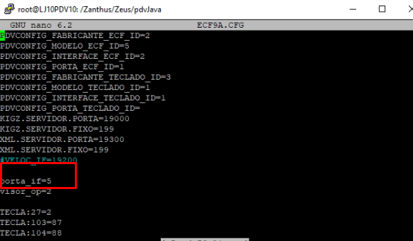
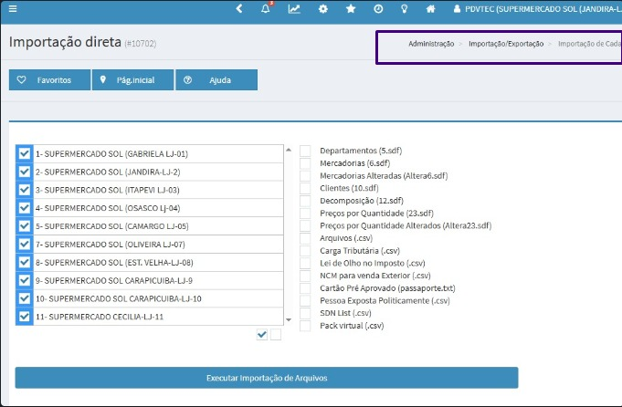
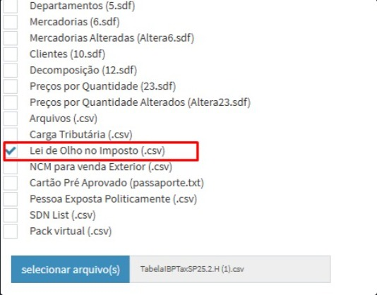

# 📚 Documentação PDV

Bem-vindo à documentação do sistema PDV.

Aqui você encontrará guias, tutoriais e informações importantes para uso e manutenção do sistema.

---

## 🚀 Objetivo

Este projeto tem como objetivo centralizar informações técnicas e facilitar o suporte e a resolução de problemas.

---

## 🛠️ Tecnologias

- Linux
- Windows
- Sistemas PDV
- Suporte remoto

---

## 📖 Conteúdo

- Instalação do sistema
- Configurações iniciais
- Resolução de problemas
- Atualizações

---

## 🖼️ Capturas do Sistema

<em>Demonstração do processo</em>

<em>Descrição da configuração</em>

<em>Execução em terminal</em>

<em>Tela IBPT</em>

---

## 📋 Exemplo de Tabela

---

## 🔗 Autor

Desenvolvido por **[Tiago Millos](https://github.com/Tiagomillos)**.